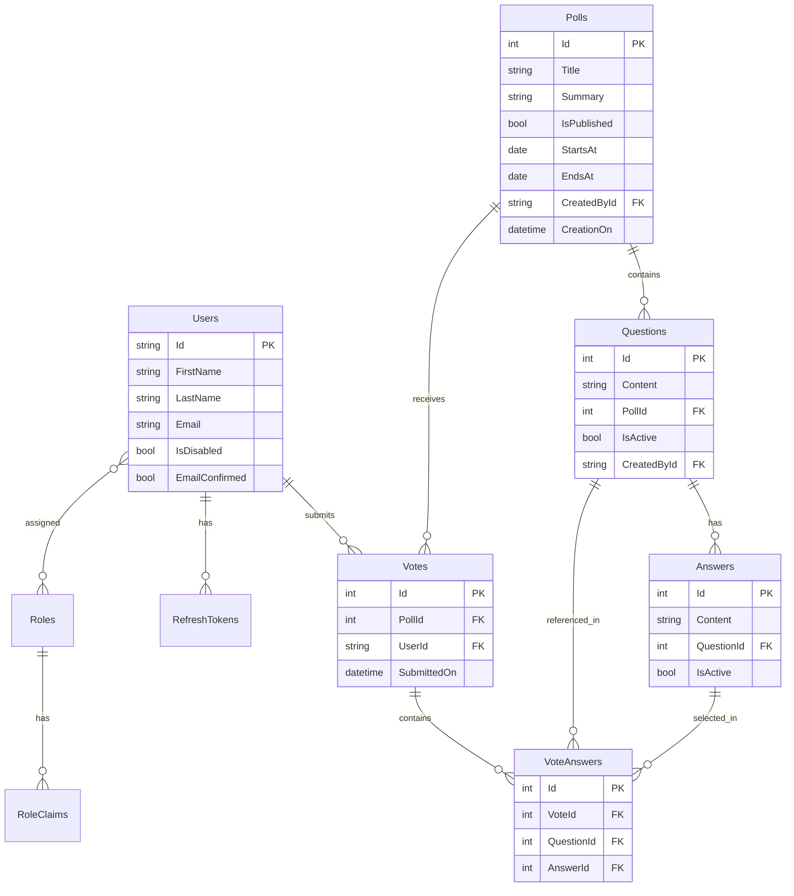

<p align="center">
  
  
  
  
  
  
</p>

<h1 align="center">📊 Survey Basket</h1>

<p align="center">
  <strong>A production-ready RESTful API for creating, managing, and analyzing surveys with real-time vote analytics.</strong>
</p>

<p align="center">
  Built with <strong>.NET 9</strong> · Secured with <strong>JWT + Refresh Tokens</strong> · Powered by <strong>Entity Framework Core</strong>
</p>

---

## 📋 Table of Contents

- [Overview](#-overview)
- [Key Features](#-key-features)
- [Architecture & Design Patterns](#-architecture--design-patterns)
- [Tech Stack](#-tech-stack)
- [Project Structure](#-project-structure)
- [API Endpoints](#-api-endpoints)
- [Database Schema](#-database-schema)
- [Getting Started](#-getting-started)
- [Configuration](#-configuration)
- [Security](#-security)

---

## 🔍 Overview

**Survey Basket** is a comprehensive survey management platform backend built from the ground up with **.NET 9**. It provides a full-featured RESTful API that enables organizations to create polls, manage questions with multiple-choice answers, collect votes from authenticated users, and generate detailed analytics — all behind a robust, permission-based authorization layer.

This project demonstrates professional-grade backend engineering practices including the **Result Pattern** for clean error handling, **custom permission-based authorization**, **rate limiting**, **structured logging with Serilog**, and **auditable entity tracking**.

---

## ✨ Key Features

### 🗳️ Poll Management
- Full CRUD operations for polls with publish/unpublish toggle
- Date-range control (`StartsAt` / `EndsAt`) for survey availability windows
- Duplicate title validation to ensure data integrity
- Retrieve currently active polls for end users

### ❓ Question & Answer Engine
- Nested question management within polls (`/api/polls/{pollId}/questions`)
- Multiple-choice answers per question with activation controls
- Server-side pagination, search, and sorting via `RequestFilters`
- Toggle question active status without deletion

### 🗳️ Voting System
- One-vote-per-user enforcement per poll (duplicate prevention)
- Validates that the poll is published and within its active date window
- Ensures all active questions are answered before submission
- Concurrency rate limiting to handle high-traffic voting periods

### 📊 Analytics & Results
- **Raw Data**: Detailed vote data with voter names, timestamps, and answer breakdowns
- **Votes Per Day**: Daily vote distribution for trend analysis
- **Votes Per Question**: Per-answer count aggregation for each question

### 🔐 Authentication & Authorization
- **JWT Bearer Tokens** with configurable expiry
- **Refresh Token** rotation with secure revocation
- **Permission-Based Access Control** using custom `[HasPermission]` attribute
- Role-based authorization (`Admin`, `Member`)
- Email confirmation flow with HTML templates
- Password reset with secure token generation
- Account lockout after 5 failed login attempts

### 👤 User Management
- Admin-controlled user creation, updates, and status toggling
- User profile self-service (view/update profile, change password)
- Account lock/unlock management

### 🛡️ Role Management
- Dynamic role creation with granular permissions
- 13+ permission types across Polls, Questions, Users, Roles, and Results
- Soft-delete for roles with toggle functionality

### ⚙️ Cross-Cutting Concerns
- **Global Exception Handling** using `IExceptionHandler` with RFC 7807 `ProblemDetails`
- **Structured Logging** with Serilog (file sink, compact JSON format, daily rolling)
- **Rate Limiting** — IP-based, user-based, and concurrency limiters
- **Health Checks** — SQL Server connectivity monitoring with UI response writer
- **Hybrid Caching** for performance optimization
- **Auditable Entities** — automatic `CreatedBy`, `CreatedOn`, `UpdatedBy`, `UpdatedOn` tracking

---

## 🏗️ Architecture & Design Patterns

```
┌─────────────────────────────────────────────────────────┐
│                   API Layer (Controllers)                │
│  AuthController · PollsController · QuestionsController  │
│  VotesController · ResultsController · UsersController   │
│  RolesController · AccountController                     │
├─────────────────────────────────────────────────────────┤
│                   Service Layer                          │
│  AuthService · PollService · QuestionService             │
│  VoteService · ResultService · UserService               │
│  RoleService · EmailService                              │
├─────────────────────────────────────────────────────────┤
│              Cross-Cutting Concerns                      │
│  Result Pattern · FluentValidation · Mapster             │
│  JWT Auth · Permission Filters · Rate Limiting           │
│  Exception Handling · Serilog Logging                    │
├─────────────────────────────────────────────────────────┤
│                 Persistence Layer                        │
│  EF Core 9 · ApplicationDbContext · Configurations       │
│  SQL Server · Migrations · Auditable Entity Tracking     │
└─────────────────────────────────────────────────────────┘
```

### Design Patterns Used

| Pattern | Implementation | Purpose |
|---------|---------------|---------|
| **Result Pattern** | `Result<T>` / `Result` with `Error` record | Eliminates exceptions for flow control; provides type-safe error propagation |
| **Service Layer** | Interface-based services with DI | Encapsulates business logic away from controllers |
| **Repository (Implicit)** | EF Core `DbContext` with LINQ | Data access through Entity Framework's built-in patterns |
| **Options Pattern** | `IOptions<JwtOptions>`, `IOptions<MailSettings>` | Strongly-typed, validated configuration binding |
| **Custom Authorization** | `IAuthorizationHandler` + `IAuthorizationPolicyProvider` | Dynamic permission-based policy generation at runtime |
| **Auditable Entities** | `AuditableEntity` base class + `SaveChangesAsync` override | Automatic audit trail on every create/update |
| **Object Mapping** | Mapster with `TypeAdapterConfig` | Convention-based and custom mapping between entities and DTOs |
| **Pagination** | Generic `PaginatedList<T>` | Efficient server-side pagination with metadata |

---

## 🛠️ Tech Stack

| Category | Technology |
|----------|-----------|
| **Framework** | .NET 9 / ASP.NET Core 9 |
| **Language** | C# 13 |
| **ORM** | Entity Framework Core 9 |
| **Database** | SQL Server |
| **Authentication** | ASP.NET Identity + JWT Bearer |
| **Authorization** | Custom Permission-Based + Role-Based |
| **Validation** | FluentValidation 12 |
| **Object Mapping** | Mapster 7.4 |
| **Logging** | Serilog (File Sink, Compact JSON) |
| **Email** | MailKit (SMTP with TLS) |
| **API Documentation** | Swashbuckle / Swagger |
| **Caching** | HybridCache (`Microsoft.Extensions.Caching.Hybrid`) |
| **Health Checks** | AspNetCore.HealthChecks (SQL Server + UI) |
| **Rate Limiting** | ASP.NET Core Rate Limiting Middleware |

---

## 📁 Project Structure

```
Survey Basket/
├── 📂 Abstractions/                    # Core abstractions & constants
│   ├── Const/
│   │   ├── DefultRoles.cs              # Admin & Member role definitions
│   │   ├── DefultUsers.cs              # Seeded admin user
│   │   ├── Permissions.cs              # 13 granular permission constants
│   │   └── RegexPatterns.cs            # Validation patterns
│   ├── Error.cs                        # Error record (Code, Message, StatusCode)
│   ├── PaginatedList.cs                # Generic server-side pagination
│   ├── Result.cs                       # Result<T> pattern implementation
│   └── ResultsExtentions.cs            # Result → ProblemDetails converter
│
├── 📂 Authentication/                  # JWT & authorization infrastructure
│   ├── Filters/
│   │   └── PermissionsRequirment.cs    # Custom [HasPermission] attribute, handler & policy provider
│   ├── IJwtProvider.cs
│   ├── JwtProvider.cs                  # Token generation & validation (HMAC-SHA256)
│   ├── JwtOptions.cs                   # Strongly-typed JWT configuration
│   └── RefreshToken.cs                 # Refresh token owned entity
│
├── 📂 Contracts/                       # Request/Response DTOs + Validators
│   ├── Answers/                        # Answer DTOs
│   ├── Authentication/                 # Login, Register, Confirm Email, Reset Password DTOs
│   ├── Common/                         # RequestFilters (pagination, search, sort)
│   ├── Polls/                          # Poll request/response + validators
│   ├── Questions/                      # Question DTOs
│   ├── Results/                        # Analytics response models
│   ├── Roles/                          # Role CRUD DTOs
│   ├── Users/                          # User management DTOs
│   └── Votes/                          # Vote submission DTOs
│
├── 📂 Controllers/                     # API endpoints (8 controllers)
│   ├── AccountController.cs            # GET /me, PUT /me/info, PUT /me/change-password
│   ├── AuthController.cs               # Login, Register, Email Confirm, Password Reset
│   ├── PollsController.cs              # Full CRUD + toggle publish
│   ├── QuestionsController.cs          # Nested CRUD under polls
│   ├── ResultsController.cs            # Vote analytics (raw, per-day, per-question)
│   ├── RolesController.cs              # Role CRUD + permissions
│   ├── UsersController.cs              # User CRUD + lock/unlock
│   └── VotesController.cs              # Start voting + submit vote
│
├── 📂 Entities/                        # Domain models
│   ├── AuditableEntity.cs              # Base entity with audit fields
│   ├── ApplicationRole.cs              # Custom IdentityRole (IsDefault, IsDeleted)
│   ├── User.cs                         # Custom IdentityUser + RefreshTokens
│   ├── Poll.cs                         # Survey with date range + publish flag
│   ├── Question.cs                     # Poll question with activation status
│   ├── Answer.cs                       # Multiple-choice answer option
│   ├── Vote.cs                         # User's vote submission
│   └── VoteAnswer.cs                   # Junction: Vote ↔ Question ↔ Answer
│
├── 📂 Errors/                          # Domain-specific error definitions
│   ├── Polls/PollError.cs
│   ├── Questions/QuestionErrors.cs
│   ├── Roles/RoleError.cs
│   ├── User/UserErrors.cs
│   └── Votes/VoteErrors.cs
│
├── 📂 Helpers/
│   └── EmailBodyBuilder.cs             # HTML email template renderer
│
├── 📂 Mapping/
│   └── MappingConfiguration.cs         # Mapster type adapter configuration
│
├── 📂 Middleware/
│   └── ExceptionHandler.cs             # Global IExceptionHandler (RFC 7807)
│
├── 📂 Persistence/                     # Data access layer
│   ├── ApplicationDbContext.cs         # EF Core context with audit interceptor
│   ├── Configurations/                 # 9 Fluent API entity configurations
│   └── Migrations/
│
├── 📂 Services/                        # Business logic layer (8 services)
│   ├── AuthService.cs                  # Full auth lifecycle (login → refresh → revoke)
│   ├── EmailService.cs                 # MailKit SMTP integration
│   ├── PollService.cs                  # Poll business rules
│   ├── QuestionService.cs              # Question management with pagination
│   ├── ResultService.cs                # Vote aggregation & analytics queries
│   ├── RoleService.cs                  # Role & permission management
│   ├── UserService.cs                  # User lifecycle management
│   └── VoteService.cs                  # Vote validation & submission
│
├── 📂 Settings/
│   └── MailSettings.cs                 # SMTP configuration model
│
├── 📂 Templates/                       # HTML email templates
│   ├── EmailConfirmation.html
│   └── ForgetPassword.html
│
├── DependencyInjection.cs              # Centralized service registration
├── Program.cs                          # Application entry point
└── appsettings.json                    # Application configuration
```

---

## 🔌 API Endpoints

### 🔑 Authentication (`/Auth`)

| Method | Endpoint | Description | Auth |
|--------|----------|-------------|------|
| `POST` | `/Auth` | Login with email & password | ❌ |
| `POST` | `/Auth/register` | Register a new account | ❌ |
| `POST` | `/Auth/confirm-email` | Confirm email with verification code | ❌ |
| `POST` | `/Auth/resend-confirm-email` | Resend confirmation email | ❌ |
| `POST` | `/Auth/forget-password` | Request password reset code | ❌ |
| `POST` | `/Auth/reset-password` | Reset password with code | ❌ |
| `POST` | `/Auth/refresh` | Refresh access token | ❌ |
| `POST` | `/Auth/revoke-refresh-token` | Revoke a refresh token | ❌ |

### 👤 Account (`/me`)

| Method | Endpoint | Description | Auth |
|--------|----------|-------------|------|
| `GET` | `/me` | Get current user profile | ✅ |
| `PUT` | `/me/info` | Update profile information | ✅ |
| `PUT` | `/me/change-password` | Change password | ✅ |

### 📊 Polls (`/api/Polls`)

| Method | Endpoint | Description | Permission |
|--------|----------|-------------|------------|
| `GET` | `/api/Polls` | Get all polls | `polls:read` |
| `GET` | `/api/Polls/current` | Get active polls (Members) | Role: Member |
| `GET` | `/api/Polls/{id}` | Get poll by ID | ✅ Authenticated |
| `POST` | `/api/Polls` | Create a new poll | ✅ Authenticated |
| `PUT` | `/api/Polls/{id}` | Update a poll | ✅ Authenticated |
| `DELETE` | `/api/Polls/{id}` | Delete a poll | ✅ Authenticated |
| `PUT` | `/api/Polls/{id}/togglePublish` | Toggle publish status | ✅ Authenticated |

### ❓ Questions (`/api/polls/{pollId}/Questions`)

| Method | Endpoint | Description | Auth |
|--------|----------|-------------|------|
| `GET` | `/api/polls/{pollId}/Questions` | List questions (paginated) | ✅ |
| `GET` | `/api/polls/{pollId}/Questions/{id}` | Get question with answers | ✅ |
| `POST` | `/api/polls/{pollId}/Questions` | Add question with answers | ✅ |
| `PUT` | `/api/polls/{pollId}/Questions/{id}` | Update question | ✅ |
| `PUT` | `/api/polls/{pollId}/Questions/{id}/toggleStatus` | Toggle active status | ✅ |

### 🗳️ Votes (`/api/polls/{pollId}/vote`)

| Method | Endpoint | Description | Auth |
|--------|----------|-------------|------|
| `GET` | `/api/polls/{pollId}/vote` | Get available questions to vote | Admin |
| `POST` | `/api/polls/{pollId}/vote` | Submit vote | Admin |

### 📈 Results (`/api/polls/{pollId}/Results`)

| Method | Endpoint | Description | Auth |
|--------|----------|-------------|------|
| `GET` | `/api/polls/{pollId}/Results/row-data` | Get raw vote data | ✅ |
| `GET` | `/api/polls/{pollId}/Results/votes-per-day` | Daily vote distribution | ✅ |
| `GET` | `/api/polls/{pollId}/Results/votes-per-question` | Per-question answer breakdown | ✅ |

### 👥 Users (`/api/Users`)

| Method | Endpoint | Description | Permission |
|--------|----------|-------------|------------|
| `GET` | `/api/Users` | List all users | `users:read` |
| `GET` | `/api/Users/{id}` | Get user details | `users:read` |
| `POST` | `/api/Users` | Create user | `users:add` |
| `PUT` | `/api/Users/{id}` | Update user | `users:update` |
| `PUT` | `/api/Users/{id}/toggle-status` | Enable/disable user | ✅ |
| `PUT` | `/api/Users/{id}/unlock` | Unlock locked user | ✅ |

### 🔧 Roles (`/api/Roles`)

| Method | Endpoint | Description | Permission |
|--------|----------|-------------|------------|
| `GET` | `/api/Roles` | List all roles | `roles:read` |
| `GET` | `/api/Roles/{id}` | Get role with permissions | `roles:read` |
| `POST` | `/api/Roles` | Create role with permissions | `roles:add` |
| `PUT` | `/api/Roles/{id}` | Update role permissions | `roles:update` |
| `PUT` | `/api/Roles/{id}/toggle-status` | Toggle role status | `roles:update` |

---

## 🗄️ Database Schema



---

## 🚀 Getting Started

### Prerequisites

- [.NET 9 SDK](https://dotnet.microsoft.com/download/dotnet/9.0) or later
- [SQL Server](https://www.microsoft.com/en-us/sql-server) (LocalDB, Express, or full edition)
- (Optional) [Visual Studio 2022](https://visualstudio.microsoft.com/) v17.8+

### Installation

```bash
# 1. Clone the repository
git clone https://github.com/MahmoudHussien74/Survey-Basket-Project.git
cd Survey-Basket-Project

# 2. Restore dependencies
dotnet restore

# 3. Update the connection string in appsettings.json
#    (default: LocalDB)

# 4. Apply database migrations
dotnet ef database update --project "Survey Basket"

# 5. Run the application
dotnet run --project "Survey Basket"
```

The API will be available at `https://localhost:5001` with Swagger UI at `/swagger`.

### Default Admin Credentials

| Field | Value |
|-------|-------|
| **Email** | `admin@survey-basket.com` |
| **Password** | *(set via User Secrets or seed data)* |

> 💡 The admin user is seeded through EF Core migrations with a pre-hashed password and `Admin` role with all permissions.

---

## ⚙️ Configuration

### `appsettings.json`

```jsonc
{
  "ConnectionStrings": {
    "DefaultConnection": "Server=(localdb)\\MSSQLLocalDB;Database=surveybasket_v1;Trusted_Connection=True"
  },
  "Jwt": {
    "Key": "YOUR_SECRET_KEY",        // Store in User Secrets
    "Issuer": "SurveyBasket",
    "Audience": "Survey Basket Users",
    "ExpiryMinutes": 300
  },
  "MailSettings": {
    "Mail": "your-email@provider.com",
    "DisplayName": "Survey Basket",
    "Host": "smtp.provider.com",
    "Port": 587,
    "Password": "YOUR_APP_PASSWORD"  // Store in User Secrets
  }
}
```

### User Secrets (Recommended for sensitive data)

```bash
dotnet user-secrets set "Jwt:Key" "your-256-bit-secret-key-here"
dotnet user-secrets set "MailSettings:Password" "your-smtp-password"
```

---

## 🔒 Security

This project implements multiple layers of security:

| Layer | Implementation |
|-------|---------------|
| **Authentication** | JWT Bearer tokens (HMAC-SHA256) with configurable expiry |
| **Token Refresh** | Secure refresh token rotation with revocation support |
| **Authorization** | Custom permission-based + role-based access control |
| **Password Policy** | Minimum 8 characters, email confirmation required |
| **Account Lockout** | 5 failed attempts → 5-minute lockout |
| **Rate Limiting** | IP-based (fixed window), user-based, and concurrency limiters |
| **Error Handling** | RFC 7807 `ProblemDetails` — no stack trace leakage |
| **Cascade Prevention** | All FK cascade deletes restricted to prevent data loss |
| **Audit Trail** | Automatic `CreatedBy`/`UpdatedBy` tracking on entities |

---

## 📄 License

This project is open source and available under the [MIT License](LICENSE).

---

<p align="center">
  <sub>Built with ❤️ by <a href="https://github.com/MahmoudHussien74">Mahmoud Hussien</a></sub>
</p>
